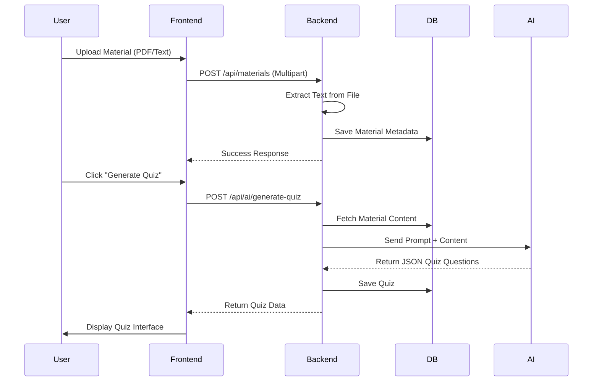
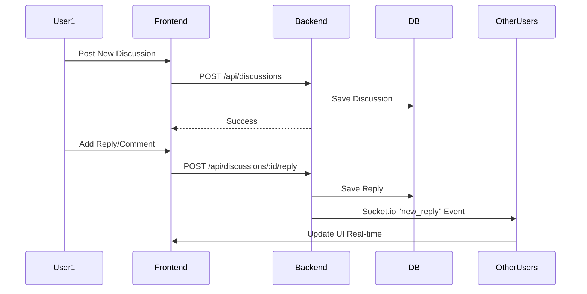

# System Architecture

## 🏗️ High-Level Archietcture

```mermaid
graph TD
    Client[Frontend (React)]
    API[Backend API (Express/Node.js)]
    DB[(MongoDB Atlas)]
    AI[AI Service Adapter]
    
    Client -->|HTTP/REST| API
    Client -->|Socket.io| API
    API -->|Mongoose| DB
    API -->|API Calls| AI
    
    subgraph "AI Providers"
        AI --> OpenAI
        AI --> Gemini
        AI --> Anthropic
        AI --> Groq
    end
```

## 🔄 User Flows

### 1. Material Processing & Quiz Generation



### 2. Discussion & Real-time Interaction



## 📂 Project Structure

```
ai-study-assistant/
├── backend/
│   ├── config/         # DB connection
│   ├── controllers/    # Request logic
│   ├── models/         # Mongoose User, Material, Quiz schemas
│   ├── routes/         # API Endpoints
│   ├── services/       # AI Adapter, Email Service
│   └── server.js       # Entry point
│
└── frontend/
    ├── src/
    │   ├── components/ # Reusable UI components
    │   ├── pages/      # Main views (Dashboard, Materials, etc.)
    │   ├── utils/      # API wrappers (axios)
    │   └── App.js      # Routing
```
